## Предисловие

**Nuxt** — "фреймворк над фреймворком Vue" или  популярная конфигурация Vue-based приложений с использованием лучших  практик разработки на Vue. Среди них: организация каталогов приложения;  включение и преконфигурация самых популярных инструментов в виде Nuxt  модулей; включение [Vuex](https://vuex.vuejs.org/ru/) по-умолчанию в любую конфигурацию; готовый и преднастроенный [SSR](https://ssr.vuejs.org/ru/#что-такое-серверный-рендеринг-ssr) с [hot-reloading'ом](https://vue-loader-v14.vuejs.org/ru/features/hot-reload.html)

**Django** — самый популярный веб-фреймворк на почти самом  популярном языке программирования на сегодняшний день — Python. Сами  разработчики позиционируют проект как "Веб-фреймворк для перфекционистов с дедлайнами". Представляет из себя решение "всё в одном" и позволяет в кратчайшие сроки построить MVP вашего веб-приложения.

**GraphQL** — язык запросов изначально созданный компанией  Facebook. В статье будет говориться о конкретных реализациях протокола  этого языка, а именно библиотек **Apollo** для фронтенда и **graphene** для бэкенда.

## О чем и для кого эта статья

В этой статье вы сможете узнать как можно собрать dev-окружение современного [SPA](https://ru.wikipedia.org/wiki/Одностраничное_приложение) приложения с server side рендерингом, на основе фреймворков Django и Nuxt, а также их сообщения посредством GraphQL API. 

На примере простейшего приложения со списком задач, я попытался  рассказать об основных проблемах с которыми я столкнулся в процессе  построения приложения на выбранном стеке.

Описание старался делать как можно более понятным, в том числе и  новичкам в программировании (коим, буду честен, я считаю и себя), и  приводить как можно больше ссылок.

Исходя из того, что эту статью вы читаете на русском языке, я делаю  смелое предположение, что и остальные материалы по программированию вы  также предпочитаете читать на русском, поэтому все ссылки я старался  подбирать в соответствии с этим предположением насколько это возможно.

Искрене надеюсь, что статья поможет сэкономить хоть немного времени  тем энтузиастам, кто решит создать свое приложения на базе приведенных  выше технологий, а также дать быстрый старт всем интересующимся без  необходимости проводить часы и дни в поисках причин возникающих проблем, а затем и их решений на просторах интернета.

Построение приложения будет вестись поэтапно, чтобы на каждом этапе можно было удостовериться что всё работает правильно.

## Перед началом

Убедитесь, что у вас уже установлен [node.js](https://nodejs.org/ru/) и интерпретатор [python](https://www.python.org/downloads/). В примере используются версии: **13.9** и **3.7** соответственно. 

В качестве менеджера виртуального окружения python в статье будет использоваться [pipenv](https://webdevblog.ru/pipenv-rukovodstvo-po-novomu-instrumentu-python/).

Консольные команды в статье запускаются в оболочке bash. Если вы пользователь Windows, то вместо команд `cd`, `mv`, `mkdir` используйте аналоги, и благодаря кросс-платформенной природе python и  node, всё остальное должно работать вне зависимости от ОС.

В качестве базы данных для простоты будет использоваться Sqlite, которая не требует дополнительной конфигурации.

Версии всех пакетов вы всегда можете посмотреть в [репозитории](https://github.com/IngvarListard/nuxt-django-graphql-example) статьи. Ниже я приведу те, что мы будем устанавливать вручную.

**Python библиотеки**

| Библиотека                                                   | Версия |
| ------------------------------------------------------------ | ------ |
| [django](https://docs.djangoproject.com/en/2.2/releases/2.2/) | 2.2    |
| [graphene-django](https://docs.graphene-python.org/projects/django/en/latest/) | 2.8.2  |
| [django-cors-headers](https://github.com/adamchainz/django-cors-headers) | 3.2    |


**Javascript библиотеки**

| Библиотека                                                   | Версия |
| ------------------------------------------------------------ | ------ |
| [Nuxt](https://nuxtjs.org)                                   | 2.11   |
| [nuxtjs/apollo](https://github.com/nuxt-community/apollo-module) | 4.0.1  |
| [nuxtjs/vuetify](https://v15.vuetifyjs.com/en/)              | 0.5.5  |
| [cookie-universal-nuxt](https://github.com/microcipcip/cookie-universal/tree/master/packages/cookie-universal-nuxt) | 2.1.2  |
| [graphql-tag](https://github.com/apollographql/graphql-tag)  | 2.10   |


## Django

### Создание проекта и окружения

Для начала необходимо установить менеджер виртуального окружения. В примере я буду использовать pipenv. Для установки:

```sh
pip install pipenv
```

В некоторых операционных системах для этого действия могут  потребоваться права суперпользователя. Также pipenv можно установить из  репозитория вашей операционной системы.

Создадим директорию с проектом и инициализируем в ней окружение `pipenv`. В моем случае проект будет располагаться по пути `~/Documents/projects/todo-list`. Создадим эту директорию и перейдем в неё.

```sh
mkdir ~/Documents/projects/todo-list
cd ~/Documents/projects/todo-list
```

Создаем виртуальное окружение и одновременно устанавливаем `django` и `graphene_django`:

```sh
pipenv install django==2.2.10 graphene_django
```

Библиотека `graphene_django` позволяет описывать схему  GraphQL API на основе моделей Django ORM. Очень удобно, но как по мне,  со связыванием таблиц БД и фронтом напрямую нужно быть очень осторожным.

Для начала активируем виртуальное окружение pipenv. Далее в статье  будет предполагаться, что все комманды будут выполняться внутри  окружения.

```sh
pipenv shell  # активируем виртуальное окружение pipenv
```

Создаем проект Django. 

```sh
django-admin createapp backend
```

### Настройка

#### Перенос manage.py

Так как фронтенд и бэкенд нашего todo-листа будет находиться в одной  директории, было бы неплохо иметь все управляющие файлы в корневой  директории проекта. В Django управляющим файлом является `manage.py`, давайте вынесем его из директории `backend` на уровень повыше. 

Для этого, из корневой директории проекта:

```sh
mv backend/manage.py .
```

После перемещения нужно исправить путь к файлу настроек внутри файла `manage.py`.

```python
# manage.py
import os
import sys

if __name__ == "__main__":
    # укажите путь к файлу настроек вашего проекта
    os.environ.setdefault("DJANGO_SETTINGS_MODULE", "backend.backend.settings")
    ...
```

Также в файле `backend/backend/settings.py` приведем следующие переменные к виду:

```python
ROOT_URLCONF = 'backend.backend.urls'
WSGI_APPLICATION = 'backend.backend.wsgi.application'
```

#### Добавление graphene_django

В файле `backend/backend/settings.py` в переменную `INSTALLED_APPS` добавляем установленный ранее `graphene_django`:

```python
# backend/backend/settings.py

INSTALLED_APPS = [
  ...,
  'graphene_django',
]
```

#### Проверяем работоспособность

```sh
python manage.py runserver
```

По-умолчанию сервер запускается на порту `8000`. Переходим на http://localhost:8000/, он должен нас встречать следующей картиной:




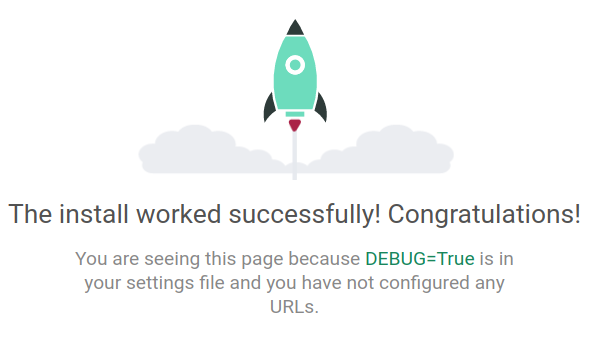




#### Настройка graphene

После изменений ниже `http://localhost:8000/` уже не будет встречать нас ракетой. В файле `backend/backend/urls.py`

```python
# backend/backend/urls.py
from django.contrib import admin
from django.urls import path
from graphene_django.views import GraphQLView
from django.conf import settings

urlpatterns = [
    path('admin/', admin.site.urls),
    # graphiql - мини IDE для разработки graphql запросов
    path('graphql/', GraphQLView.as_view(graphiql=settings.DEBUG))
]
```

Создадим пустую [схему](https://xsltdev.ru/react/graphql/schemas-and-types/), например, в файле `backend/backend/api.py`

```python
# backend/todo_list/api.py
import graphene
schema = graphene.Schema()
```

В файл настроек необходимо добавить переменную `GRAPHENE`, в которой мы укажем путь до нашей схемы:

```python
# /backend/backend/settings.py
GRAPHENE = {
    'SCHEMA': 'backend.backend.api.schema',
}
```

Проверяем работоспособность. Запускаем сервер уже известной командой `runserver`:

```sh
python manage.py runserver
```

и переходим на http://localhost:8000/graphql/. Там нас должна встретить та самая мини "IDE" [GrapiQL](https://github.com/graphql/graphiql):



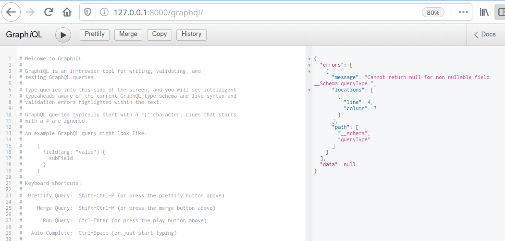



Ничего страшного в том, что нас встречает ошибка. Она появляется  из-за того, что наша схема пуста. Мы исправим это при реализации дальше.


### Приложение todo_list


#### Создание приложения

Создадим приложение todo_list и модели к нему. Не забывайте, что все команды должны выполняться внутри окружения pipenv:

```sh
cd backend
django-admin startapp todo_list
```

Скрипт `django-admin` не знает где находится корень нашего приложения, поэтому нам нужно немного подправить файл `backend/todo_list/apps.py`, чтобы он выглядит следующим образом:

```python
from django.apps import AppConfig

class TodoListConfig(AppConfig):
    name = 'backend.todo_list'
```

Добавим наше новое приложение в `INSTALLED_APPS`, что находится в файле `settings.py`:

```python
# backend/backend/settings.py
INSTALLED_APPS = [
    ...,
    'backend.todo_list',
    ...
]
```

Добавим модели `Todo` и `Category` в файл `backend/todo_list/models.py`:


```python
# backend/todo_list/models.py
from datetime import timedelta

from django.db import models
from django.utils import timezone

class Category(models.Model):
    name = models.CharField(max_length=100, unique=True)

    class Meta:
        verbose_name = 'Категория'
        verbose_name_plural = 'Категории'

    def __str__(self):
        return self.name

def get_due_date():
    """ На выполнение задачи по-умолчанию даётся один день """
    return timezone.now() + timedelta(days=1)

class Todo(models.Model):
    title = models.CharField(max_length=250)
    text = models.TextField(blank=True)
    created_date = models.DateField(auto_now_add=True)
    due_date = models.DateField(default=get_due_date)
    category = models.ForeignKey(Category, related_name='todo_list', on_delete=models.PROTECT)
    done = models.BooleanField(default=False)

    class Meta:
        verbose_name = 'Задача'
        verbose_name_plural = 'Задачи'

    def __str__(self):
        return self.title
```


Для того, чтобы наши модели превратились в таблицы в БД, нужно выполнить следующее: 

Создать файлы [миграций](https://djbook.ru/rel1.7/topics/migrations.html), в которых будет описываться наша текущая схема:

```sh
python manage.py makemigrations
```

С примерно таким выводом:

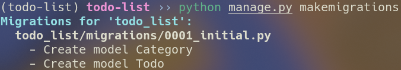

Применить эти миграции командой `migrate`. Т.к. это первый запуск скрипта `migrate`, у нас также будут применяться миграции приложений Django:

```sh
python manage.py migrate
```



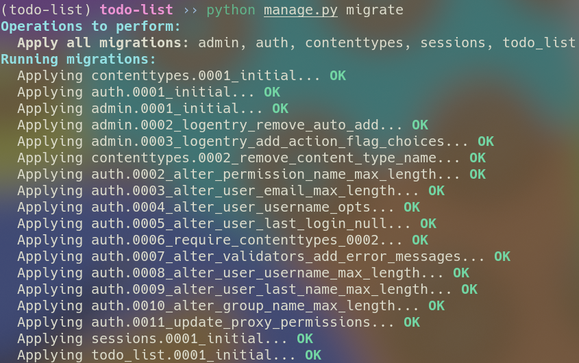



#### Создание GraphQL API

Опишем [типы](https://xsltdev.ru/react/graphql/schemas-and-types/), [создадим запросы и мутации](https://xsltdev.ru/react/graphql/queries-and-mutations/) для наших новых моделей. Для этого в директории приложения `todo_list` создадим файл `schema.py`, со следующим содержимым:



```python
# backend/todo_list/schema.py
import graphene
from graphene_django import DjangoObjectType

from backend.todo_list.models import Todo, Category

# С помощью graphene_django привязываем типы к моделям,
# что позволит ходить по всей вложенности базы данных как угодно,
# прямо из интерфейса GraphiQL.
# Однако будьте осторожны, связывание таблиц практически напрямую
# с фронтом может быть чревато при росте проекта. Думаю такой способ
# подходит преимущественно для небольших CRUD приложений.
class CategoryNode(DjangoObjectType):
    class Meta:
        model = Category

class TodoNode(DjangoObjectType):
    class Meta:
        model = Todo

class Query(graphene.ObjectType):
    """ Описываем запросы и возвращаемые типы данных """
    todo_list = graphene.List(TodoNode)
    categories = graphene.List(CategoryNode)

    def resolve_todo_list(self, info):
        return Todo.objects.all().order_by('-id')

    def resolve_categories(self, info):
        return Category.objects.all()

class Mutation(graphene.ObjectType):
    """ В мутации описываем типы запросов (простите за каламбур),
    типы возвращаемых данных и типы принимаемых переменных
    """
    add_todo = graphene.Field(TodoNode,
                              title=graphene.String(required=True),
                              text=graphene.String(),
                              due_date=graphene.Date(required=True),
                              category=graphene.String(required=True))
    remove_todo = graphene.Field(graphene.Boolean, todo_id=graphene.ID())
    toggle_todo = graphene.Field(TodoNode, todo_id=graphene.ID())

    def resolve_add_todo(self, info, **kwargs):
        category, _ = Category.objects.get_or_create(name=kwargs.pop('category'))
        return Todo.objects.create(category=category, **kwargs)

    def resolve_remove_todo(self, info, todo_id):
        try:
            Todo.objects.get(id=todo_id).delete()
        except Todo.DoesNotExist:
            return False
        return True

    def resolve_toggle_todo(self, info, todo_id):
        todo = Todo.objects.get(id=todo_id)
        todo.done = not todo.done
        todo.save()
        return todo
```



После создания классов мутации и запроса, их нужно добавить в нашу схему. Как вы, возможно, помните схему мы описывали в файле `api.py`:

```python
# backend/backend/api.py
import graphene
from backend.todo_list.schema import Query, Mutation
schema = graphene.Schema(query=Query, mutation=Mutation)
```

Если хотите лучше понять происходящее, можете прочитать [эту](https://habr.com/ru/post/461939/) статью на Хабре, или обратиться к документации [Graphene](https://docs.graphene-python.org/en/latest/types/) (англ.).


#### Проверка API

ID записей в примерах ниже могут различаться с ID ваших записей.

Запускаем сервер привычной командой `runserver`:

```sh
python manage.py runserver
```

Идем по пути http://localhost:8000/graphql/. Там нас должен встречать уже знакомый интерфейс `graphiql`. И как вы, возможно, заметили ошибка пропала. 

Давайте проверим получившиеся запросы и мутации.



**Мутация**

```graphql
  mutation(
    $title: String!
    $text: String
    $dueDate: Date!
    $category: String!
  ) {
    addTodo(
      title: $title
      text: $text
      dueDate: $dueDate
      category: $category
    ) {
      todo {
        id
        title
        text
        done
        createdDate
        dueDate
        category {
          id
          name
        }
      }
    }
  }
```

**Переменные**

```graphql
{
  "title": "First Todo",
  "text": "Just do it!",
  "dueDate": "2020-10-17",
  "category": "Работа"
}
```

**Результат**

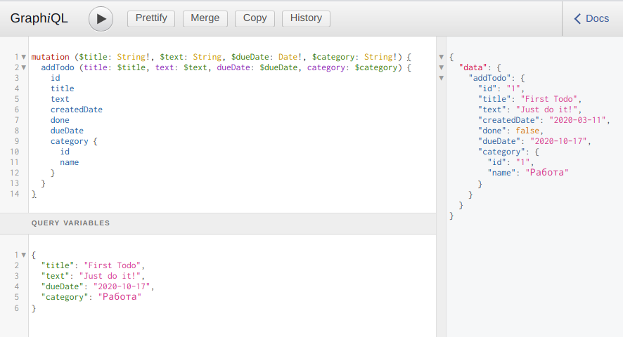



В результате этой мутации у нас создалось две записи:

- `Todo` т.к. собственно мутация для этого и написана;
- `Category`, т.к. в базе не оказалось категорий с названием "Работа", а метод `get_or_create` говорит за себя сам.



**Запрос**

```graphql
{
  todoList {
    id
    title
    text
    createdDate
    dueDate
category {
      id
      name
    }
  }
  categories {
    id
    name
  }
}
```

**Реузльтат**

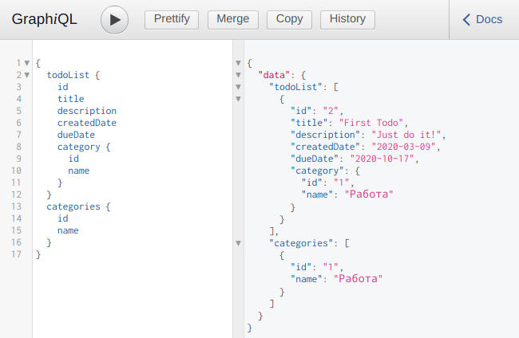





**Мутация**

```graphql
mutation ($todoId: ID) {
  toggleTodo(todoId: $todoId) {
    id
    title
    text
    createdDate
    dueDate
    category {
      id
      name
    }
    done
  }
}
```

**Переменные**

```graphql
{
  "todoId": "1"
}
```

**Результат**:

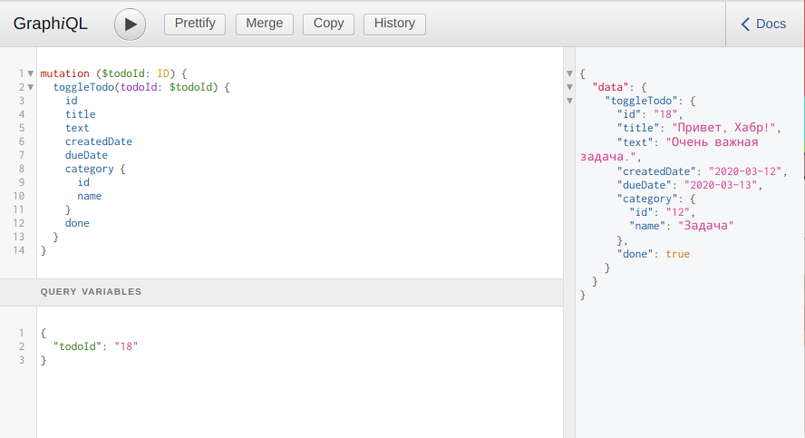





**Мутация**

```graphql
mutation ($todoId: ID) {
  removeTodo(todoId: $todoId)
}
```

Переменные можно оставить из предыдущей мутации.

**Результат**

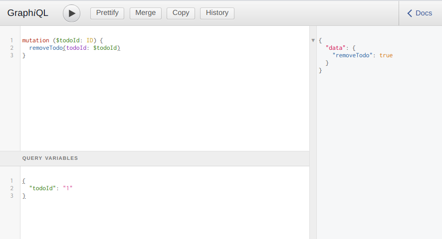



## Nuxt

### Создание Nuxt приложения

Откройте консоль внутри корневой директории проекта и запустите скрипт установки `Nuxt`:

```sh
npx create-nuxt-app frontend
```

Запустится очень простой и понятный скрипт установки, который  предложит указать описание проекта и предоставит на выбор для установки  несколько библиотек. Можете выбрать, что захотите, но из рекомендуемых  пунктов я бы посоветовал выбрать "Custom UI Framework: vuetify", т.к. в  примере используется именно он, и "Rendering mode: Universal", т.к. в  статье рассматривается пример именно с SSR.

Пример моей конфигурации:

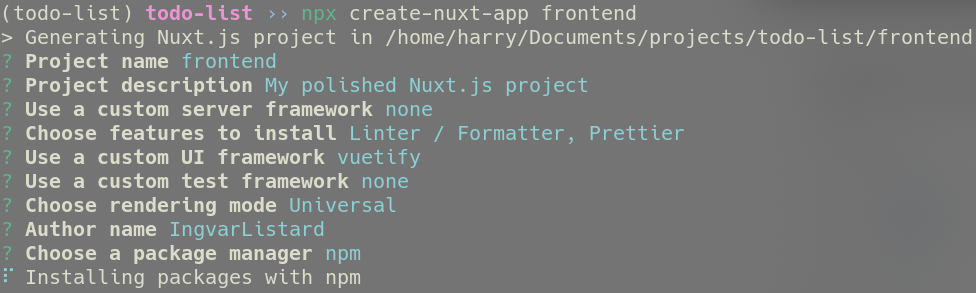

На установку зависимостей может потребоваться некоторое время. После  завершения работы скрипта вам предложат проверить его работоспособность. Давайте сделаем это:

```sh
cd frontend
npm run dev
```

и перейдем на http://localhost:3000. Там нас должна ждать страница приветствия Nuxt + Vuetify:



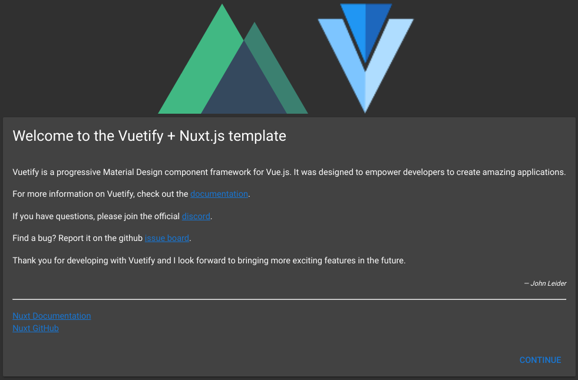



### Перенос конфигурационных файлов

Как я говорил ранее, фронтенд и бэкенд будут находиться у нас в одной директории, поэтому было бы неплохо перенести конфигурационные файлы и  зависимости на уровень повыше. Для этого из корневой папки проекта  выполните:

```sh
cd frontend
mv node_modules ..
mv nuxt.config.js ..
mv .gitignore ..
mv package-lock.json ..
mv package.json ..
mv .prettierrc ..
mv .eslintrc.js ..
mv .editorconfig ..
rm -rf .git
```

Затем в файле `nuxt.config.js` указываем корневую директорию приложения:

```js
// nuxt.config.js
export default {
  ...,
  rootDir: 'frontend',
  ...
}
```

После этого желательно еще раз убедиться в работоспособности проекта, выполнив запуск dev-сервера уже из корневой директории:

```sh
npm run dev
```

### Верстка функционального макета

Любой компонент с префиксом `v-` это компонент UI-toolkit'a Vuetify. У этой библиотеки отличная и подробная [документация](https://v15.vuetifyjs.com/ru/getting-started/quick-start).

Если вы хотите подробнее узнать, что делает тот или иной компонент, смело вбивайте в гугл `v-component-name`. Только не забывайте, что в примере используется версия vuetify 1.5.

Приводим файл `frontend/layouts/default.vue` к виду:

```vue
<template>
  <v-app>
    <v-content>
      <v-container>
        <nuxt />
      </v-container>
    </v-content>
  </v-app>
</template>
```


Создадим компонент нового `Todo` по пути `frontend/components/NewTodoForm.vue`:



```vue
<!-- frontend/components/NewTodoForm.vue -->
<template>
  <v-form ref="form" v-model="valid">
    <v-card>
      <v-card-text class="pt-0 mt-0">
        <v-layout row wrap>
          <v-flex xs8>
            <!-- Поле ввода имени задачи -->
            <v-text-field
              v-model="newTodo.title"
              :rules="[nonEmptyField]"
              label="Задача"
              prepend-icon="check_circle_outline"
            />
          </v-flex>
          <v-flex xs4>
            <!-- Поле выбора даты выполнения задачи -->
            <v-menu
              ref="menu"
              v-model="menu"
              :close-on-content-click="false"
              :nudge-right="40"
              :return-value.sync="newTodo.dueDate"
              lazy
              transition="scale-transition"
              offset-y
              full-width
              min-width="290px"
            >
              <template v-slot:activator="{ on }">
                <v-text-field
                  v-model="newTodo.dueDate"
                  :rules="[nonEmptyField]"
                  v-on="on"
                  label="Дата выполнения"
                  prepend-icon="event"
                  readonly
                />
              </template>
              <v-date-picker
                v-model="newTodo.dueDate"
                no-title
                scrollable
                locale="ru-ru"
                first-day-of-week="1"
              >
                <v-spacer />
                <v-btn @click="menu = false" flat color="primary">Отмена</v-btn>
                <v-btn
                  @click="$refs.menu.save(newTodo.dueDate)"
                  flat
                  color="primary"
                  >Выбрать</v-btn
                >
              </v-date-picker>
            </v-menu>
          </v-flex>
          <v-flex xs12>
            <v-textarea
              v-model="newTodo.text"
              :rules="[nonEmptyField]"
              label="Описание"
              prepend-icon="description"
              hide-details
              rows="1"
              class="py-0 my-0"
            />
          </v-flex>
        </v-layout>
      </v-card-text>
      <v-card-actions>
        <!-- Селектор категорий. Позволяет добавлять несуществующие позиции -->
        <v-combobox
          v-model="newTodo.category"
          :rules="[nonEmptyField]"
          :items="categories"
          hide-details
          label="Категория"
          class="my-0 mx-2 mb-2 pt-0"
          prepend-icon="category"
        />
        <v-spacer />
        <v-btn :disabled="!valid" @click="add" color="blue lighten-1" flat
          >Добавить</v-btn
        >
      </v-card-actions>
    </v-card>
  </v-form>
</template>

<script>
export default {
  name: 'NewTodoForm',
  data() {
    return {
      newTodo: null,
      categories: ['Дом', 'Работа', 'Семья', 'Учеба'],
      valid: false,
      menu: false,
      nonEmptyField: text =>
        text ? !!text.length : 'Поле не должно быть пустым'
    }
  },
  created() {
    this.clear()
  },
  methods: {
    add() {
      this.$emit('add', this.newTodo)
      this.clear()
      this.$refs.form.reset()
    },
    clear() {
      this.newTodo = {
        title: '',
        text: '',
        dueDate: '',
        category: ''
      }
    }
  }
}
</script>
```



Далее компонент существующего `Todo`, там же:



```vue
<!-- frontend/components/TodoItem.vue -->
<template>
  <v-card>
    <v-card-title class="pb-1" style="overflow-wrap: break-word;">
      <b>{{ todo.title }}</b>
      <v-spacer />
      <v-btn
        @click="$emit('delete', todo.id)"
        flat
        small
        icon
        style="position: absolute; right: 0; top: 0"
      >
        <v-icon :disabled="$nuxt.isServer" small>close</v-icon>
      </v-btn>
    </v-card-title>
    <v-card-text class="py-1">
      <v-layout row justyfy-center align-center>
        <v-flex xs11 style="overflow-wrap: break-word;">
          {{ todo.text }}
        </v-flex>
        <v-flex xs1>
          <div style="text-align: right;">
            <v-checkbox
              v-model="todo.done"
              hide-details
              class="pa-0 ma-0"
              style="display: inline-block;"
              color="green lighten-1"
            />
          </div>
        </v-flex>
      </v-layout>
    </v-card-text>
    <v-card-actions>
      <span class="grey--text">
        Выполнить до <v-icon small>event</v-icon> {{ todo.dueDate }} | Создано
        <v-icon small>calendar_today</v-icon> {{ todo.createdDate }}
      </span>
      <v-spacer />
      <span class="grey--text">
        <v-icon small>category</v-icon>Категория: {{ todo.category }}
      </span>
    </v-card-actions>
  </v-card>
</template>

<script>
export default {
  name: 'TodoItem',
  props: {
    todo: {
      type: Object,
      default: () => ({})
    }
  }
}
</script>
```



И наконец вставим новые компоненты в `index.vue`, и добавим в него немного рыбы:



```vue
<!-- frontend/pages/index.vue -->
<template>
  <v-layout row wrap justify-center>
    <v-flex xs8 class="pb-1">
      <new-todo-form @add="addTodo" />
    </v-flex>
    <v-flex v-for="todo of todoList" :key="todo.id" xs8 class="my-1">
      <todo-item :todo="todo" @delete="deleteTodo" />
    </v-flex>
  </v-layout>
</template>

<script>
import NewTodoForm from '../components/NewTodoForm'
import TodoItem from '../components/TodoItem'
export default {
  components: { TodoItem, NewTodoForm },
  data() {
    return {
      todoList: [
        {
          id: 1,
          title: 'TODO 1',
          text:
            'Lorem ipsum dolor sit amet, consectetur adipiscing elit',
          dueDate: '2020-10-16',
          createdDate: '2020-03-09',
          done: false,
          category: 'Работа'
        },
        {
          id: 2,
          title: 'TODO 2',
          text:
            'Lorem ipsum dolor sit amet, consectetur adipiscing elit',
          dueDate: '2020-10-16',
          createdDate: '2020-03-09',
          done: false,
          category: 'Работа'
        },
        {
          id: 3,
          title: 'TODO 3',
          text:
            'Lorem ipsum dolor sit amet, consectetur adipiscing elit',
          dueDate: '2020-10-16',
          createdDate: '2020-03-09',
          done: false,
          category: 'Работа'
        },
        {
          id: 4,
          title: 'TODO 4',
          text:
            'Lorem ipsum dolor sit amet, consectetur adipiscing elit',
          dueDate: '2020-10-16',
          createdDate: '2020-03-09',
          done: false,
          category: 'Работа'
        },
        {
          id: 5,
          title: 'TODO 5',
          text:
            'Lorem ipsum dolor sit amet, consectetur adipiscing elit',
          dueDate: '2020-10-16',
          createdDate: '2020-03-09',
          done: false,
          category: 'Работа'
        },
        {
          id: 6,
          title: 'TODO 6',
          text:
            'Lorem ipsum dolor sit amet, consectetur adipiscing elit',
          dueDate: '2020-10-16',
          createdDate: '2020-03-09',
          done: false,
          category: 'Работа'
        }
      ]
    }
  },
  methods: {
    addTodo(newTodo) {
      const id = this.todoList.length
        ? Math.max.apply(
            null,
            this.todoList.map(item => item.id)
          ) + 1
        : 1
      this.todoList.unshift({
        id,
        createdDate: new Date().toISOString().substr(0, 10),
        done: false,
        ...newTodo
      })
    },
    deleteTodo(todoId) {
      this.todoList = this.todoList.filter(item => item.id !== todoId)
    }
  }
}
</script>
```



После проделанной работы рекомендую проверить работоспособность получившегося макета. Запустите `dev` сервер и перейдите на http://localhost:3000/, там вы должны увидеть следующую картину:



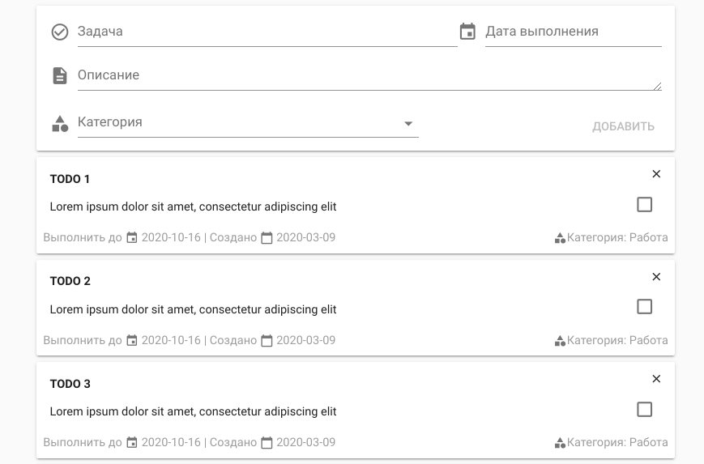



## Объединение фронтенда и бэкенда

### Настройка CSRF-защиты Django + Apollo

В Django по-умолчанию используется [CSRF](https://ru.wikipedia.org/wiki/Межсайтовая_подделка_запроса) защита.

Эта защита реализуется при помощи [промежуточного слоя](https://djbook.ru/rel1.7/topics/http/middleware.html) (middleware) — `CsrfViewMiddleware`. Посмотреть на него вы можете в файле `settings.py` в переменной `MIDDLEWARE`.

Принцип его работы очень прост: у любого POST-запроса к Django в  заголовках должен иметься CSRF-токен. Если этот токен отсутствует, то  сервер просто отклоняет этот запрос.

CSRF-токен в классическом django приложении приходит вместе с любым  GET-запросом, после чего при необходимости добавляется в формы при  рендеринге шаблона.

В нашем случае проблема в том, что вне зависимости от того,  выполняется в Apollo мутация или запрос, метод их по-умолчанию всегда  будет POST. Apollo позволяет изменить это поведение таким образом, чтобы для `Query` метод запроса был GET, а для `Mutation` — POST, но насколько я знаю, graphene на данный момент не поддерживает подобный режим работы. 

Я поступил следующим образом: немного расширил логику стандартного `CsrfViewMiddleware` таким образом, чтобы он проверял тип GraphQL запроса, и уже на основе этого принимал или сбрасывал соединение.

Для этого добавим кастомную проверку CSRF, например, в уже знакомый нам файл `api.py`



```python
# backend/backend/api.py
import json
import graphene
from django.middleware.csrf import CsrfViewMiddleware

from backend.todo_list.schema import Query, Mutation

schema = graphene.Schema(query=Query, mutation=Mutation)

class CustomCsrfMiddleware(CsrfViewMiddleware):
    def process_view(self, request, callback, callback_args, callback_kwargs):
        if getattr(request, 'csrf_processing_done', False):
            return None
        if getattr(callback, 'csrf_exempt', False):
            return None
        try:
            body = request.body.decode('utf-8')
            body = json.loads(body)
        # в любой непонятной ситуации передаём запрос оригинальному CsrfViewMiddleware
        except (TypeError, ValueError, UnicodeDecodeError):
            return super(CustomCsrfMiddleware, self).process_view(request, callback, callback_args, callback_kwargs)
        # проверка на list, т.к. клиент может отправлять "батченные" запросы
        # https://blog.apollographql.com/batching-client-graphql-queries-a685f5bcd41b
        if isinstance(body, list):
            for query in body:
                # если внутри есть хотя бы одна мутация, то отправляем запрос
                # к оригинальному CsrfViewMiddleware
                if 'mutation' in query:
                    break
            else:
                return self._accept(request)
        else:
            # принимаем любые query без проверки на csrf
            if 'query' in body and 'mutation' not in body:
                return self._accept(request)
        return super(CustomCsrfMiddleware, self).process_view(request, callback, callback_args, callback_kwargs)
```



Далее, в файле `settings.py` нужно заменить "оригинальный" `CsrfViewMiddleware`, на кастомный:

```python
# settings.py
MIDDLEWARE = [
    ...,
    'backend.backend.api.CustomCsrfMiddleware',
    # 'django.middleware.csrf.CsrfViewMiddleware',
    ...,
]
```

Если уважаемый читатель знает более надежные и правильные способы  CSRF-защиты в связке Django + Nuxt + Apollo, то призываю поделиться  своим знанием в комментариях.

### Django CORS Headers

Т.к. dev сервера бэкенда и фронтента у нас стоят на разных портах, то Django нужно оповестить, с каких хостов могут совершаться запросы, и  какие заголовки ему разрешено обрабатывать. А поможет нам в этом  библиотека `django-cors-headers`:

```sh
pipenv install "django-cors-headers>=3.2"
```

В `settings.py` добавим: 

```python
# backend/backend/settings.py
from corsheaders.defaults import default_headers

INSTALLED_APPS = [
    ...,
    'graphene_django',
    'backend.todo_list',
    'corsheaders',  # вот эту строку
]

CORS_ALLOW_CREDENTIALS = True
CORS_ALLOW_HEADERS = default_headers + ('cache-control', 'cookies')
CORS_ORIGIN_ALLOW_ALL = True  # не рекомендуется для production

# А также парочку middleware
MIDDLEWARE = [
    ...,
    'corsheaders.middleware.CorsMiddleware',
    'django.middleware.common.CommonMiddleware',
    ...,
]
```

### Установка и настройка Apollo

Для Nuxt существует собственный модуль `apollo`, который в свою очередь основан на библиотеке `vue-apollo` (которая в свою очередь основана на Apollo). Для его установки введите:

```sh
npm install --save @nuxtjs/apollo graphql-tag cookie-universal-nuxt
```

Также при конфигурации `Apollo` нам понадобится небольшая библиотека `cookie-universal-nuxt` для манипуляции куками при рендере на стороне сервера.
 Добавим эти модули в `nuxt.config.js`. В зависимости от вашей изначальной конфигурации там уже может быть несоклько модулей. Как минимум там должен быть `vuetify`:

```js
// nuxt.config.js
export default {
  ...,
  modules: [
    ...,
    '@nuxtjs/vuetify',
    '@nuxtjs/apollo',
    'cookie-universal-nuxt'
  ],
  apollo: {
    clientConfigs: {
      default: '~/plugins/apollo-client.js'
    }
  },
  ...
}
```

Настройка Apollo дело невсегда тривиальное. Постараемся обойтись  минимальной конфигурацией. Создадим файл по указанному выше пути:

Конфигурируем клиент `Apollo`, а вместе с тем формируем цепочку обработчиков запросов.



```js
// frontend/plugins/apollo-client.js
import { HttpLink } from 'apollo-link-http'
import { setContext } from 'apollo-link-context'
import { from, concat } from 'apollo-link'
import { InMemoryCache } from 'apollo-cache-inmemory'

// Если плагин является функцией, то в процессе инициализации Nuxt передаёт в неё контекст ctx
export default ctx => {
  /**
   * По-умолчанию при рендере со стороны сервера заголовки
   * в запросе к бэкенду не отправляются, так что "пробрасываем"
   * заголовки от клиента.
   */
  const ssrMiddleware = setContext((_, { headers }) => {
    if (process.client) return headers
    return {
      headers: {
        ...headers,
        connection: ctx.app.context.req.headers.connection,
        referer: ctx.app.context.req.headers.referer,
        cookie: ctx.app.context.req.headers.cookie
      }
    }
  })

  /**
   * Добавление CSRF-токена к запросу.
   * https://docs.djangoproject.com/en/2.2/ref/csrf/#ajax
   */
  const csrfMiddleware = setContext((_, { headers }) => {
    return {
      headers: {
        ...headers,
        'X-CSRFToken': ctx.app.$cookies.get('csrftoken') || null
      }
    }
  })
  const httpLink = new HttpLink({
    uri: 'http://localhost:8000/graphql/',
    credentials: 'include'
  })
  // Middleware в Apollo это примерно тоже самое что и middleware в Django, 
  // только на стороне клиента. Объединяем их в цепочку. Последовательность важна.
  const link = from([csrfMiddleware, ssrMiddleware, httpLink])
  // Инициализируем кэш. При должном усердии он может заменить Vuex,
  // но об этом как-нибудь в другой раз
  const cache = new InMemoryCache()

  return {
    link,
    cache,
    // без отключения стандартного apollo-module HttpLink'a в консоль сыпятся варнинги
    defaultHttpLink: false
  }
}
```



На этом этапе лучше еще раз удостовериться, что Nuxt собирается без ошибок, запустив dev сервер.

### Оживляем приложение

И вот наконец настало время соединить фронт и бэк.

Для начала где-нибудь создадим файл, в котором будут храниться все  запросы и мутации к бэкенду. В моем случае этот файл расположился по  пути `frontend/graphql.js` с уже знакомым нам содержимым:



```js
import gql from 'graphql-tag'

// т.к. внутренности записи Todo используются практически во всех запросах,
// то резонно вынести их в отдельный фрагмент
// https://www.apollographql.com/docs/react/data/fragments/
const TODO_FRAGMENT = gql`
  fragment TodoContents on TodoNode {
    id
    title
    text
    done
    createdDate
    dueDate
    category {
      id
      name
    }
  }
`

const ADD_TODO = gql`
  mutation(
    $title: String!
    $text: String
    $dueDate: Date!
    $category: String!
  ) {
    addTodo(
      title: $title
      text: $text
      dueDate: $dueDate
      category: $category
    ) {
      ...TodoContents
    }
  }
  ${TODO_FRAGMENT}
`

const TOGGLE_TODO = gql`
  mutation($todoId: ID) {
    toggleTodo(todoId: $todoId) {
      ...TodoContents
    }
  }
  ${TODO_FRAGMENT}
`

const GET_CATEGORIES = gql`
  {
    categories {
      id
      name
    }
  }
`

const GET_TODO_LIST = gql`
  {
    todoList {
      ...TodoContents
    }
  }
  ${TODO_FRAGMENT}
`

const REMOVE_TODO = gql`
  mutation($todoId: ID) {
    removeTodo(todoId: $todoId)
  }
`

export { ADD_TODO, TOGGLE_TODO, GET_CATEGORIES, GET_TODO_LIST, REMOVE_TODO }
```



Теперь нужно немного изменить уже существующий функционал фронтенда.  Наконец пришло время добавить туда взаимодействие с бэкендом.

Изменим Vue компоненты:



```vue
<!-- frontend/pages/index.vue -->
<template>
  <v-layout row wrap justify-center>
    <v-flex xs8 class="pb-1">
      <!-- emit'ы теперь нам не нужны -->
      <new-todo-form />
    </v-flex>
    <v-flex v-for="todo of todoList" :key="todo.id" xs8 class="my-1">
      <todo-item :todo="todo" />
    </v-flex>
  </v-layout>
</template>

<script>
import NewTodoForm from '../components/NewTodoForm'
import TodoItem from '../components/TodoItem'
// импортируем свеженаписанные запросы
import { GET_TODO_LIST } from '../graphql'

export default {
  components: { TodoItem, NewTodoForm },
  data() {
    return {
      todoList: []
    }
  },
  apollo: {
    // получаем список todoList. При таком объявлении запроса переменная todoList
    // должна записаться результатами запроса, однако запрос должен называться
    // аналогично с переменной
    todoList: { query: GET_TODO_LIST }
  }
}
</script>
```





```vue
<!-- frontend/components/NewTodoForm.vue -->
<template>
  <v-card>
    <v-card-title class="pb-1" style="overflow-wrap: break-word;">
      <b>{{ todo.title }}</b>
      <v-spacer />
      <!-- Изменено событие -->
      <v-btn
        @click="remove"
        flat
        small
        icon
        style="position: absolute; right: 0; top: 0"
      >
        <v-icon :disabled="$nuxt.isServer" small>close</v-icon>
      </v-btn>
    </v-card-title>
    <v-card-text class="py-1">
      <v-layout row justyfy-center align-center>
        <v-flex xs11 style="overflow-wrap: break-word;">
          {{ todo.text }}
        </v-flex>
        <v-flex xs1>
          <div style="text-align: right;">
            <!-- Добавлена обработка клика -->
            <v-checkbox
              :value="todo.done"
              @click.once="toggle"
              hide-details
              class="pa-0 ma-0"
              style="display: inline-block;"
              color="green lighten-1"
            />
          </div>
        </v-flex>
      </v-layout>
    </v-card-text>
    <v-card-actions>
      <span class="grey--text">
        Выполнить до <v-icon small>event</v-icon> {{ todo.dueDate }} | Создано
        <v-icon small>calendar_today</v-icon> {{ todo.createdDate }}
      </span>
      <v-spacer />
      <span class="grey--text">
        <!-- Изменен путь получения имени категории -->
        <v-icon small>category</v-icon>Категория: {{ todo.category.name }}
      </span>
    </v-card-actions>
  </v-card>
</template>

<script>
// импортируем свеженаписанные запросы
import { GET_TODO_LIST, REMOVE_TODO, TOGGLE_TODO } from '../graphql'

export default {
  name: 'TodoItem',
  props: {
    todo: {
      type: Object,
      default: () => ({})
    }
  },
  // с этого момента изменения по-серьезнее
  methods: {
    toggle() {
      // Для запроса который возвращает измененный элемент не обязательно
      // вручную прописывать функцию update. Apollo сам найдёт в каких
      // запросах "участвует" измененная запись, и разошлет всем подписчикам
      // измененный объект. В нашем случае это запрос в компоненте index.vue
      // на получение списка Todo
      this.$apollo.mutate({
        mutation: TOGGLE_TODO,
        variables: {
          todoId: this.todo.id
        }
      })
    },
    remove() {
      // функция update не видит контекста this
      const todoId = this.todo.id
      this.$apollo.mutate({
        mutation: REMOVE_TODO,
        variables: {
          todoId
        },
        update(store, { data: { removeTodo } }) {
          if (!removeTodo) return
          // В случае успешного удаления удаляем текущий элемент из кэша
          const data = store.readQuery({ query: GET_TODO_LIST })
          data.todoList = data.todoList.filter(todo => todo.id !== todoId)
          // Самоуничтожаемся!
          store.writeQuery({ query: GET_TODO_LIST, data })
        }
      })
    }
  }
}
</script>
```





```vue
<!-- frontend/components/TodoItem.vue -->
<template>
  <v-card>
    <v-card-title class="pb-1" style="overflow-wrap: break-word;">
      <b>{{ todo.title }}</b>
      <v-spacer />
      <!-- Изменено событие -->
      <v-btn
        @click="remove"
        flat
        small
        icon
        style="position: absolute; right: 0; top: 0"
      >
        <v-icon :disabled="$nuxt.isServer" small>close</v-icon>
      </v-btn>
    </v-card-title>
    <v-card-text class="py-1">
      <v-layout row justyfy-center align-center>
        <v-flex xs11 style="overflow-wrap: break-word;">
          {{ todo.text }}
        </v-flex>
        <v-flex xs1>
          <div style="text-align: right;">
            <!-- Добавлена обработка клика -->
            <v-checkbox
              :value="todo.done"
              @click.once="toggle"
              hide-details
              class="pa-0 ma-0"
              style="display: inline-block;"
              color="green lighten-1"
            />
          </div>
        </v-flex>
      </v-layout>
    </v-card-text>
    <v-card-actions>
      <span class="grey--text">
        Выполнить до <v-icon small>event</v-icon> {{ todo.dueDate }} | Создано
        <v-icon small>calendar_today</v-icon> {{ todo.createdDate }}
      </span>
      <v-spacer />
      <span class="grey--text">
        <!-- Изменен путь получения имени категории -->
        <v-icon small>category</v-icon>Категория: {{ todo.category.name }}
      </span>
    </v-card-actions>
  </v-card>
</template>

<script>
// импортируем свеженаписанные запросы
import { GET_TODO_LIST, REMOVE_TODO, TOGGLE_TODO } from '../graphql'

export default {
  name: 'TodoItem',
  props: {
    todo: {
      type: Object,
      default: () => ({})
    }
  },
  // с этого момента изменения по-серьезнее
  methods: {
    toggle() {
      // Для запроса который возвращает измененный элемент не обязательно
      // вручную прописывать функцию update. Apollo сам найдёт в каких
      // запросах "участвует" измененная запись, и разошлет всем подписчикам
      // измененный объект. В нашем случае это запрос в компоненте index.vue
      // на получение списка Todo
      this.$apollo.mutate({
        mutation: TOGGLE_TODO,
        variables: {
          todoId: this.todo.id
        }
      })
    },
    remove() {
      // функция update не видит контекста this
      const todoId = this.todo.id
      this.$apollo.mutate({
        mutation: REMOVE_TODO,
        variables: {
          todoId
        },
        update(store, { data: { removeTodo } }) {
          if (!removeTodo) return
          // В случае успешного удаления удаляем текущий элемент из кэша
          const data = store.readQuery({ query: GET_TODO_LIST })
          data.todoList = data.todoList.filter(todo => todo.id !== todoId)
          // Самоуничтожаемся!
          store.writeQuery({ query: GET_TODO_LIST, data })
        }
      })
    }
  }
}
</script>
```



Проверим, что у нас получилось


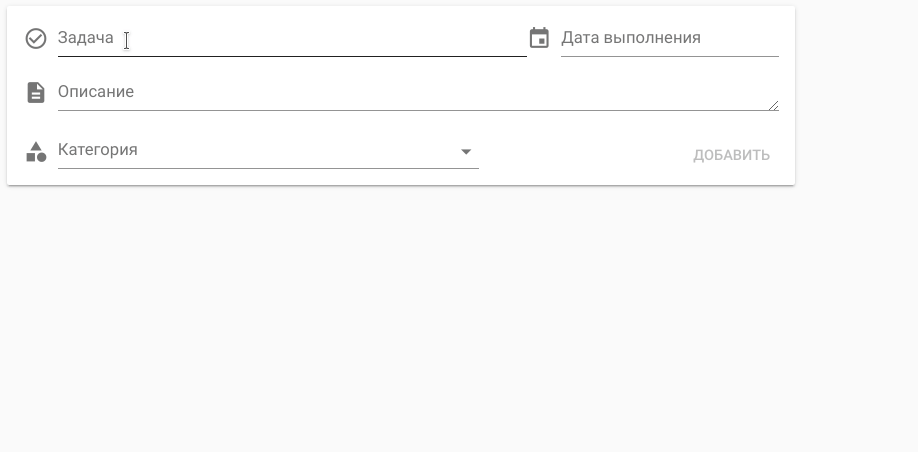



## Заключение

В этой статье я попытался рассказать как построить взаимодействие  между Django и Nuxt с помощью GraphQL API, показать решение проблем с  которыми довелось столкнуться мне. Надеюсь это подтолкнет энтузиастов  попробовать что-то новое, и сэкономит время в решении проблем. 

Весь код доступен на [GitHub](https://github.com/IngvarListard/nuxt-django-graphql-example).
