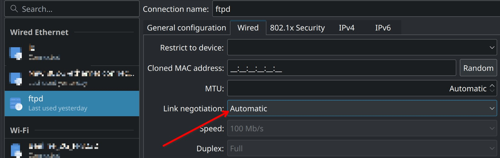
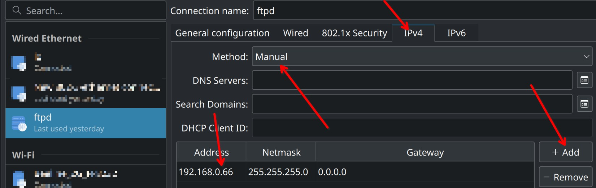

## Проблема

На досуге ради интереса и большого потенциала, решил прошить свой роутер на открытую прошивку [OpenWrt](https://openwrt.org). Прошиться было очень просто - в админке роутера, в разделе Firmware просто выбрать бинарник с прошивкой, и дождаться загрузки роутера. После наката OpenWrt с досадой обнаружил, что для подключения к интернету на моем провайдере используется VPN-протокол L2TP. Однако в прошивке OpenWrt для роутера Archer C6 по-умолчанию не были предустановлены пакеты для работы по этому протоколу. Для того, чтобы установить их, нужен интернет, а чтобы подключиться к интернету нужен L2TP. Замкнутый круг. Помимо установки зависимостей из репозиториев есть возможность установить все пакеты вручную с помощью ssh, scp, но мне показалось это муторным, и я просто решил вернуть старую прошивку. 

Для начала, я попробовал сделать также, как и при прошивке OpenWrt - через веб интерфейс выбрать файл и прошиться на сток. Несмотря на то, что админка предоставила такую возможность, роутер после сего действа просто умер. После загрузки загорался индикатор питания, но ничего не происходило.

Что же, я знал на что иду, но попытка не пытка. Так я пришел к необходимости восстановления роутера посредством TFTP-сервера из recovery mode'a TPLink Archer C6. 

Ниже приведу пошаговую инструкцию по настройке TFTP-сервера и прошивки роутера.

## TFTP?
До того как встретился с необходимостью прошивки роутера я ничего не знал про этот протокол, в том числе и про его существование. Но пришлось познакомиться. 

**TFTP** (Trivial File Transfer Protocol) - как видно из названия это элементарнейший протокол обмена файлами. Из интересных команд у него всего get - получить файл и put - отправить файл. Однако из-за своего минимализма и простоты реализации он идеально подходит для встраиваемых систем с ограниченым объемом памяти.

## Решение

### Что будем делать

Для восстановления роутера с помощью recovery mode'a необходимо предоставить возможность роутеру в recovery mode загрузить файл прошивки с tftp-сервера. tftp-сервер должен находиться на определенном IP и порту. Итого, если кратко:

- на ПК вручную прописать адрес 192.168.0.66 (ip по которому ходит роутер на tftp-сервер)
- подключить роутер к ПК по ethernet кабелю
- установить и запустить tftp сервер на порту 69
- дождаться пока роутер сам себя прошьет

### Пререквизиты

Я использую Manjaro Linux с KDE, однако с небольшими изменениями инструкция должна подходить для любого дистрибутива Linux, и скорее всего MacOS. Итого, что нужно:
- ПК/Ноут на (Arch-based) Linux
- пачкорд
- роутер
- терпение

### Установка и настройка TFTP-сервера

В качестве реализации сервера я выбрал tftp-hpa как рекомендует [ArchWiki](https://wiki.archlinux.org/title/TFTP#tftp-hpa).

1. Установить tftp-сервер
```sh
sudo pacman -S tftp-hpa
```
2. Скорректировать конфиг tftp-hpa по пути /etc/conf.d/tftpd, чтобы он содержал следующее:
```
TFTPD_ARGS="--secure /srv/tftp/ --create --verbosity 5 --address 0.0.0.0:69 --username=tftp"
```
где:

- `/srv/tftp/`
- путь то директории где будет лежать наша прошивка <br>
- `--create` - запустить сервер с возможностью создавать файлы
- `--verbosity 5` - писать DEBUG логи в syslog
- `--adress` - хост и порт на котором будет запущен сервер. Порт ставим по-умолчанию - 69

3. Запустить systemd демон tftp-сервера:
```sh
sudo systemctl start tftpd
```
4. Чтобы не заморачиваться с пользователями, правами, группами -- разрешить полный доступ к директории /srv/tftp/
```sh
sudo chmod -R 777 /srv/tftp
```
5. Загрузить прошивкув соответствии с ревизией из поста https://4pda.to/forum/index.php?showtopic=976692&view=findpost&p=121017717
Для начала попробуйте самую старую, для ревизии 2, например, это Archer `C6(RU)_V2_20190115.zip`. Если не получилось - поочередно поднимайте версию до тех пор, пока не получится. Мне потребовалось 2 попытки, таким образом, рабочим образом для моего роутера была `Archer C6(RU)_V2_200508.zip`
7. Проверить, что сервер может отдавать файлы
Пункт необходим из-за очень скудных логов сервера tftp.
- запустить tftp клиент
```sh
tftp
```
- после успешного подключения появится приглашение командной строки. Выполнить команду загрузки файла ниже, и нажать enter:
```
get ArcherC6v2_tp_recovery.bin
```
- в случае успеха вы не получите никакого соощбения, но в директории в которой была запущена команда появится наш файл `ArcherC6v2_tp_recovery.bin`
- если произошла ошибка permission denied, выполнить
```sh
sudo chmod 777 ArcherC6v2_tp_recovery.bin
```
- повторно выполнить команду `get ArcherC6v2_tp_recovery.bin`
- если появилась ошибка file not found, то либо вы забыли исправить конфиг (см п.2), либо выполняете на отличном от arch-based дистрибутиве (конфиг должен лежать в другом месте)

### Настройка проводного подключения

Как было упомянуто выше, необходимо сделать так, чтобы TFTP-сервер был в сети роутера по определенному IP и на определенном порту. Для этого настроим проводное подключение.

1. Подключить включенный роутер к ПК с помощью ethernet кабеля. В роутер воткнуть в любой порт КРОМЕ WAN. Если в настройках сети у вас отсутствует проводное соединение, по после подключения оно должно автоматически создасться. Желательно, чтобы на момент прошивки к ПК был подключен только один ethernet кабель для предупреждения возможных коллизий.

2. Открыть настройки проводного соединения (которое отвечает за подключение к роутеру). Я использую KDE, скриншоты будут оттуда. Выполнить следующие настройки:
    - на вкладке Wired установить значение поля Link negotiation в Automatic
    - на кладке ipv4:
        - Method: Manual
        - Нажать кнопку добавить в таблице. Добавить адресс 192.168.0.66, маска 255.255.255.0

Сохранить. Подключиться.

Если всё сделано правильно, то соединение должно пройти корректно.






### Прошивка

Для того, чтобы мы могли понять, пробует ли роутер подключиться к TFTP-серверу, необходимо подключиться к DEBUG логам TFTP-сервера с помощью journalctl. Как смотреть DEBUG логи по отдельному юниту я разбираться не стал, поэтому просто подключимся к стриму и будем ждать сообщений помеченных как `in.tftpd`. Для этого в терминале выполнить:

```sh
sudo journalctl -f
```

И прошиваем.

1. Выключить роутер. Соединение пропадет. В окне с логами будет много логов от network manager'a.
2. Зажать кнопку reset на роутере, одновременно включить роутер. Держать reset до тех пор, пока не загорится индикатор замка.
3. Наблюдать за логами journalctl. Если все сделано правильно, должно появиться сообщение вроде такого:
```
дек 31 20:17:20 username-pc in.tftpd[14732]: *RRQ from 192.168.0.86 filename ArcherC6v2_tp_recovery.bin*
```
Если сообщение появилось - радуйтесь. Роутер перезагрузится. Не трогайте его 5-7 минут. Если по прошествии этого времени остался гореть только самый левый индикатор, выберите другую версию прошивки и повторите п11.