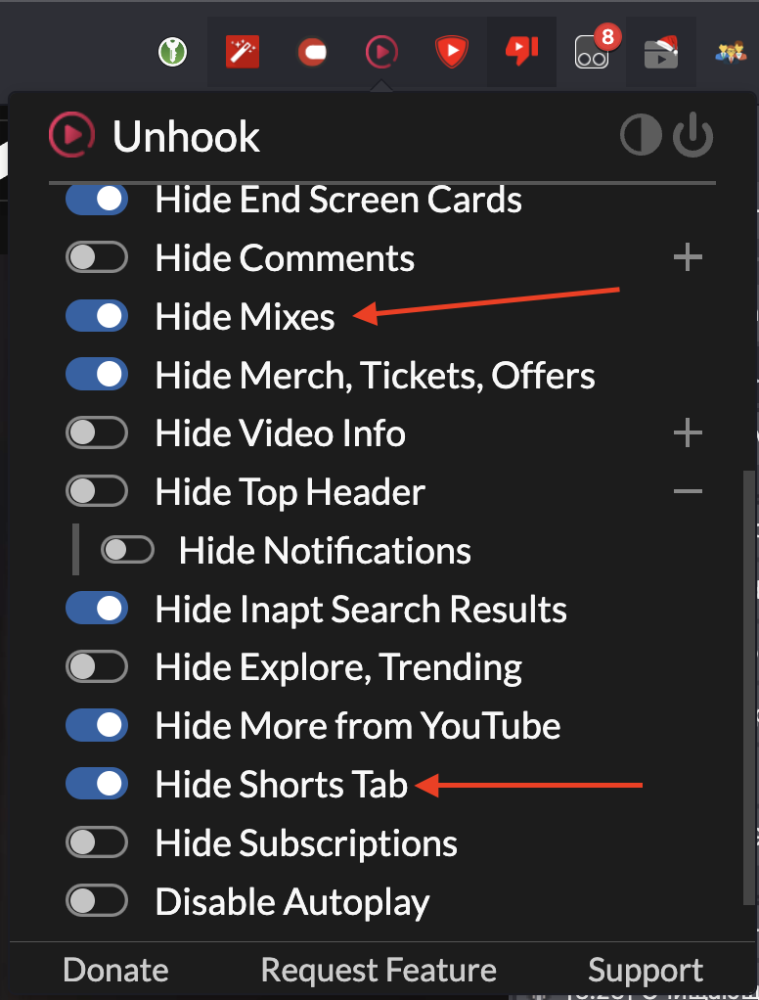
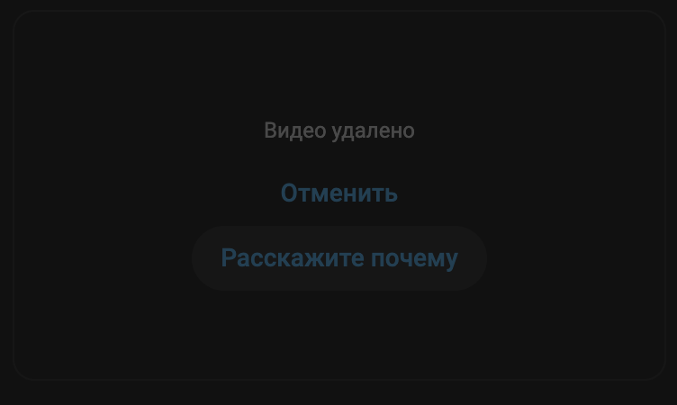
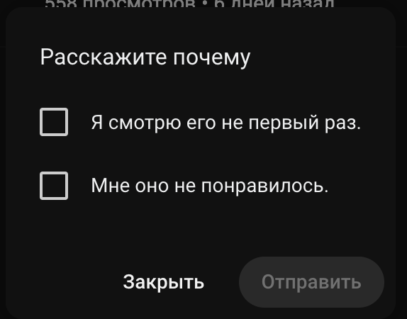
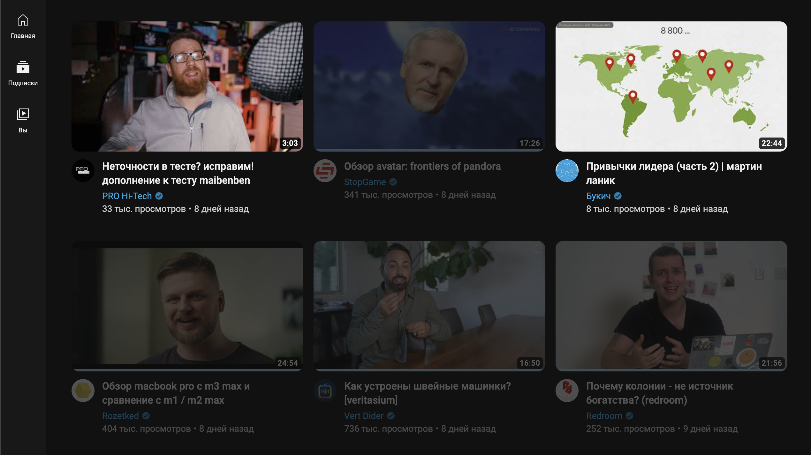
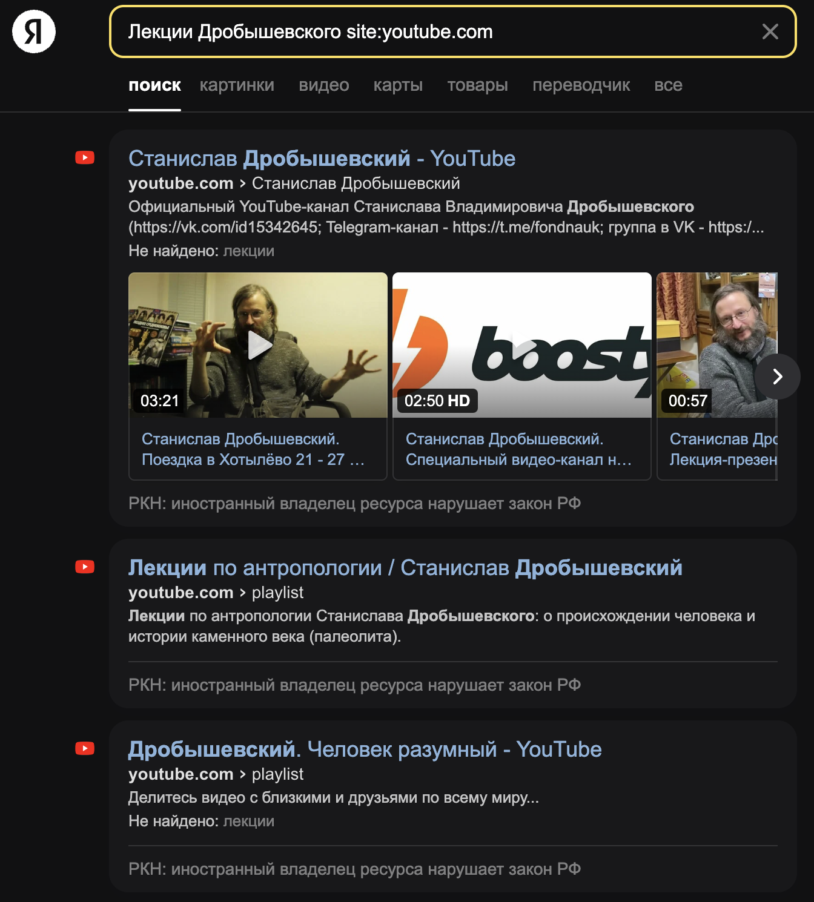

# Проблема

  YouTube'ом пользуются все. Кто-то для развлечения, кто-то для обучения. Лично я провожу в нем часы ежедневно: просмотр MOOC курсов, научно-популярных докладов, интервью, прослушивание каких-либо видео в фоне или во время еды.

  Однако в последнее моя поисковая и рекомендательная выдача сильно упала в качестве. Мне прилетает большое количество рекомендаций уже просмотренных или частично просмотренных видео, видео с одних и тех же каналов. Такое ощущение, что я оказался в изоляции внутри пузыря своих подписок.

  Также раздражает назойливые рекламные интеграции, которые зачастую разрывают повествование и снижают концентрацию. Раздражают постоянно появляющиеся одни и те же "миксы", надоедливые shorts'ы. В поисковой выдачи после 5 релевантных видео появляются видео из рекомендаций, что жутко бесит.

  В итоге, чаша переполнилась, я расчехлил гугл, и ниже опишу, чего интересного я там нашел.

# Решение

Я использую Chrome-based браузер и android смартфон. Решения для firefox будут аналогичными, а вот решения для IOS придется искать самостоятельно.

## Блокировка рекламы

Для браузера достаточно поставить следующие расширения:
  + [uBlock Origin](https://chromewebstore.google.com/detail/ublock-origin/cjpalhdlnbpafiamejdnhcphjbkeiagm) - если еще не стоит. Режет нативную рекламу YouTube
  + [SponsorBlock](https://chromewebstore.google.com/detail/sponsorblock-%D0%B4%D0%BB%D1%8F-youtube/mnjggcdmjocbbbhaepdhchncahnbgone) - автоматический пропуск назойливых интеграций, самореклам и тому подобных вещей. Имеет огромное количество настроек.

На Android же рекомендую поставить приложение YouTube ReVanced:
  + [YouTube ReVanced 4pda](https://4pda.to/forum/index.php?showtopic=1050118)  
    По сути оригинальное приложение YouTube с вырезанной рекламой, в том числе и спонсорской.

## Улучшение выдачи

Для удаления Shorts'ов и Mix'ов ставим расширение Unhook:
  + [Unhook - Remove YouTube Recommended Videos](https://chromewebstore.google.com/detail/unhook-remove-youtube-rec/khncfooichmfjbepaaaebmommgaepoid)
Ставим соответствующие галки:





Для улучшения качества рекомендаций нужно явно дать понять YouTube'у какие видео вам не нравятся. На это уйдет какое-то количество времени. У меня процесс занял порядка двух-трех дней. Для этого на странице рекомендаций на не понравившихся видео нужно нажать меню "Три точки" -> Не интересует -> Расскажите почему, и, собственно, расскажите.




Для скрытия просмотренных видео необходимо:

  1. Установить расширение [Tampermonkey](https://chromewebstore.google.com/detail/tampermonkey/dhdgffkkebhmkfjojejmpbldmpobfkfo)
  2. Установить user-script [YouTube: Hide Watched Videos](https://greasyfork.org/en/scripts/13040-youtube-hide-watched-videos/code)

В итоге должно получиться как-то так




Чтобы поисковая выдача в YouTube не отвлекала вас рекомендациями, а релевантность была на высоте, достаточно перестать пользоваться поиском видео в YouTube, а использовать поиск Google и Яндекс, добавив к поисковому запросу ~site:youtube.com~. Ходят слухи, что выдача в Яндексе даже лучше. Пример запроса:





## Кардинальные методы

 Если вы обучаетесь по роликам из YouTube'a и не хотите отвлекаться на котиков во время обучения, а пользоваться рекомендациями YouTube все еще хотите, то заведите отдельный аккаунт для обучения, в котором будете просматривать только соответствующий контент. Через какое-то время алгоритмы YouTube обучатся на ваших просмотрах, и будет подсовывать релевантную выдачу. Для удобного использования сразу нескольких аккаунтов в Firefox есть прекрасное расширение [Firefox Multi-Account Containers](https://addons.mozilla.org/en-US/firefox/addon/multi-account-containers/), которое позволяет создавать изолированный контекст серфинга, и в одном окне браузера заходить в n-е число аккаунтов на одном ресурсе. Полноценных альтернатив для Chrome-based браузера я не нашел, но есть аналог [MultiLogin](https://chromewebstore.google.com/detail/multilogin/ijfgglilaeakmoilplpcjcgjaoleopfi).

Если вы переживаете, что YouTube следит за вами, и вас беспокоит этот факт, то есть альтернативные свободные (Open-source) клиенты YouTube как для веба, так и для Android
  + [NewPipe](https://newpipe.net) - альтернативный, свободный клиент для Android. Позволяет просматривать видео, формировать плейлисты и подписки без рекламы и наличия YouTube-аккаунта. Доступен в Google Play и F-Droid.
  + [Piped (GitHub)](https://github.com/TeamPiped/Piped?tab=readme-ov-file) - альтернативный веб клиент YouTube. Позволяет делать всё тоже, что и NewPipe. Не следит за вами, выдает качественные результаты поиска без примеси рекомендаций. Быстр и удобен. Однако для безопасного и надежного использования крайне рекомендуется развернуть собственный инстанс клиента.

